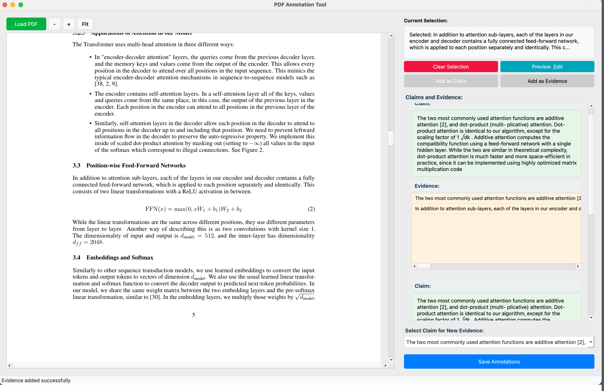

# 🖊️ Annotation Tool

## PDF Annotation Tool

A desktop application for annotating PDF documents with claims and corresponding evidence. This tool allows users to select text from PDF documents, organize them into claims and evidence pairs, and manage annotations efficiently.

---

## ✨ Features

- **📄 PDF Viewing**
  - Load and view PDF documents
  - Smooth scrolling and navigation
  - Zoom controls (buttons and keyboard shortcuts)
  - Automatic fit-to-width functionality

- **✏️ Text Selection**
  - Click and drag to select text
  - Multiple selections can be combined
  - Preview and edit selected text
  - Clear selection option

- **📝 Annotation Management**
  - Create claims from selected text
  - Add multiple pieces of evidence for each claim
  - Clear organization of claims and their corresponding evidence
  - Visual hierarchy for better understanding

- **🎨 User-Friendly Interface**
  - Intuitive controls
  - Visual feedback for actions
  - Status bar messages
  - Keyboard shortcuts

---

## 📈 Results

---

## 💻 Installation

### Prerequisites

- Python 3.7 or higher
- PyQt5
- PyMuPDF (fitz)

---