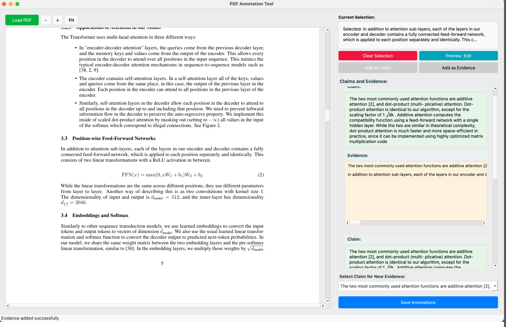

# 📊 RC_BENCH
Repository for RC_BENCH project


## 📝 Annotator Guidelines

### Task Description

Your task is to identify all statements in the text that qualify as claims under the following criteria:

1. **🎯 Specificity**: The statement makes a specific, testable assertion about results, methods, or contributions.
2. **✨ Novelty**: The statement represents a novel finding, improvement, or advancement.
3. **💡 Clarity**: The statement presents a clear position or conclusion.

### Requirements

- ✅ Include both major and minor claims.
- ✅ Ensure no claim is overlooked.
- ✅ Present each claim as a separate item.

## 🔍 Evidence Identification

For each identified claim, find and document relevant evidence that:

1. **🔗 Relevance**: Directly supports or contradicts the claim's specific assertion.
2. **📊 Concrete Support**: Is presented with experimental results, data, or concrete examples.
3. **📍 Traceability**: Can be traced to specific methods, results, or discussion sections in the text.
4. **❌ Exclusions**: Evidence must not be derived from the abstract or introduction sections of the text.

## ✅ Conclusion Analysis

- **⚖️ Justification**: Evaluate whether the conclusions drawn in the text are justified by the evidence provided.

## 📋 Annotation Format

Each annotation should be formatted as follows:

```json
{
    "Claim_id": "<unique_identifier>",
    "Claim_text": "<text_of_the_claim>",
    "Evidence_text": "<text_supporting_or_contradicting_the_claim>",
    "Justification_Conclusion": "<evaluator's_comment_on_evidence_justification>"
}
```

## 📁 Folders and Files Description 

For each model in `{Gemini, Claude, GPT}`, the following folder structure is maintained:

### 📂 `{model}_3_prompts/`
- Contains outputs from the 3-prompts code execution
- Each prompt runs independently for claims, evidence, and conclusions

### 📂 `{model}_one_by_one/`
- Houses outputs from iterative building process:
  1. Get all claims first
  2. For each claim, fetch corresponding evidence
  3. For each claim-evidence pair, generate conclusion

### 📂 `{model}_all_at_one/`
- Stores outputs from single-prompt execution
- All tasks (claims, evidence, conclusions) processed in one go

```
project/
├── {model}_3_prompts/
├── {model}_one_by_one/
└── {model}_all_at_one/
```

*Note: Replace `{model}` with Gemini, Claude, or GPT accordingly.*


# 🖊️ Annotation tool README

# PDF Annotation Tool

A desktop application for annotating PDF documents with claims and corresponding evidence. This tool allows users to select text from PDF documents, organize them into claims and evidence pairs, and save the annotations in a structured JSON format.



## ✨ Features

- **📄 PDF Viewing**
  - Load and view PDF documents
  - Smooth scrolling and navigation
  - Zoom controls (buttons and keyboard shortcuts)
  - Automatic fit-to-width functionality

- **✏️ Text Selection**
  - Click and drag to select text
  - Multiple selections can be combined
  - Preview and edit selected text
  - Clear selection option

- **📝 Annotation Management**
  - Create claims from selected text
  - Add multiple pieces of evidence for each claim
  - Clear organization of claims and their corresponding evidence
  - Visual hierarchy for better understanding

- **🎨 User-Friendly Interface**
  - Intuitive controls
  - Visual feedback for actions
  - Status bar messages
  - Keyboard shortcuts


## 📈 Results


## 💻 Installation

### Prerequisites
- Python 3.7 or higher
- PyQt5
- PyMuPDF (fitz)

## 📚 Citations

If you use RC_BENCH in your research, please cite:

```bibtex
@article{rcbench2024,
  title={Can AI Validate Science? Benchmarking LLMs for Accurate Scientific Claim -> Evidence Reasoning},
  author={SR Javaji et al.},
  journal={arxiv},
  year={2025}
}
```

