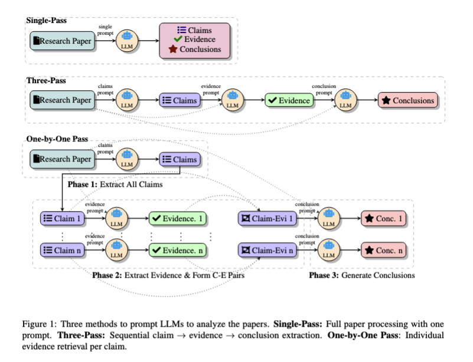
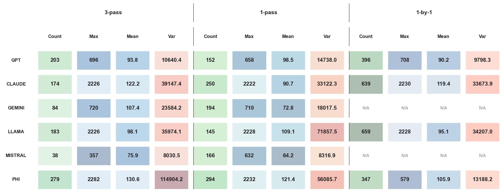

# 📊 CLAIM_BENCH
Repository for CLAIM_BENCH project

**Paper Title:**  
#### “Can AI Validate Science? Benchmarking LLMs for Accurate Scientific Claim → Evidence Reasoning” 

---

## 🎯 Mission

Provide a transparent benchmark (**CLAIM‑BENCH**) and reproducible code for evaluating long‑context LLMs on sentence‑level claim evidence identification for scientific reasoning.

---

## 📑 Abstract
--- 

Large language models (LLMs) are increasingly being used for complex research tasks such as literature review, idea generation, and scientific paper analysis, yet their ability to truly understand and process the intricate relationships within complex research papers—such as the logical links between claims and supporting evidence—remains largely unexplored.

In this study, we present **CLAIM-BENCH**, a comprehensive benchmark for evaluating LLMs' capabilities in scientific claim-evidence extraction and validation, a task that reflects deeper comprehension of scientific argumentation. We systematically compare three approaches, inspired by divide and conquer strategies, across six diverse LLMs, highlighting model-specific strengths and weaknesses in scientific comprehension.

Through evaluation involving over 300 claim-evidence pairs across multiple research domains, we reveal significant limitations in LLMs' ability to process complex scientific content. Our results demonstrate that closed-source models like GPT-4 and Claude consistently outperform open-source counterparts in precision and recall across claim-evidence identification tasks. Furthermore, strategically designed three-pass and one-by-one prompting approaches significantly improve LLMs' abilities to accurately link dispersed evidence with claims, although this comes at increased computational cost.

**CLAIM-BENCH** sets a new standard for evaluating scientific comprehension in LLMs, offering both a diagnostic tool and a path forward for building systems capable of deeper, more reliable reasoning across full-length papers.

 ---
 
## Different strategies



---

## 📁 Repo Structure

```text
RC_BENCH/
│
├── Code/                                           # All scripts and Jupyter notebooks
│   ├── .DS_Store                                  # System file (can be ignored)
│   ├── 3_open_models_combined_3_prompts.py        # Script: combines 3 open models using 3 prompts
│   ├── 3_open_models_combined_all_at_once.py      # Script: combines 3 open models, runs all at once
│   ├── 3_open_models_combined_one_by_one.py       # Script: combines 3 open models, runs one by one
│   ├── Annotation_tool_v1.py                      # Main annotation tool script (version 1)
│   ├── RC_Claude.ipynb                            # Jupyter notebook for RC_Claude model analysis
│   ├── RC_GPT.ipynb                               # Jupyter notebook for RC_GPT model analysis
│   └── RC_Gemini.ipynb                            # Jupyter notebook for RC_Gemini model analysis
│
├── Data/                                           # All input data files
│   ├── .DS_Store                                  # System file (can be ignored)
│   └── all_papers/                                # Directory: collection of PDF papers for annotation
│
├── Results/                                        # All outputs, annotations, and figures
│   ├── .DS_Store                                  # System file (can be ignored)
│   ├── All models Outputs/                        # Model output files (claims, evidence, conclusions, etc.)
│   ├── Statistics/                                # Aggregated results/statistics (merged or processed)
│   ├── all_annotations/                           # Annotated results from the tool
│   ├── all_inter_annotations/                     # Intermediate or cross-annotator results
│   └── figures/                                   # All figures/plots for results and tool screenshots
│
├── .env                                           # API keys and secrets (not tracked, see .gitignore)
├── .gitignore                                     # Should include .env, .DS_Store, and other files to ignore
├── README.md                                      # General project documentation
└── ANNOTATION_TOOL.md                             # Documentation for the annotation tool
```

--- 


## 📝 Annotator Guidelines

### Task Description

Your task is to identify all statements in the text that qualify as claims under the following criteria:

1. **🎯 Specificity**: The statement makes a specific, testable assertion about results, methods, or contributions.
2. **✨ Novelty**: The statement represents a novel finding, improvement, or advancement.
3. **💡 Clarity**: The statement presents a clear position or conclusion.

### Requirements

- ✅ Include both major and minor claims.
- ✅ Ensure no claim is overlooked.
- ✅ Present each claim as a separate item.

## 🔍 Evidence Identification

For each identified claim, find and document relevant evidence that:

1. **🔗 Relevance**: Directly supports or contradicts the claim's specific assertion.
2. **📊 Concrete Support**: Is presented with experimental results, data, or concrete examples.
3. **📍 Traceability**: Can be traced to specific methods, results, or discussion sections in the text.
4. **❌ Exclusions**: Evidence must not be derived from the abstract or introduction sections of the text.

## ✅ Conclusion Analysis

- **⚖️ Justification**: Evaluate whether the conclusions drawn in the text are justified by the evidence provided.

## 📋 Annotation Format

Each annotation should be formatted as follows:

```json
{
    "Claim_id": "<unique_identifier>",
    "Claim_text": "<text_of_the_claim>",
    "Evidence_text": "<text_supporting_or_contradicting_the_claim>",
    "Justification_Conclusion": "<evaluator's_comment_on_evidence_justification>"
}
```


## 📈 Results


**Figure 2:**  
Precision vs. Recall for claim (solid markers) and evidence (transparent markers) identification across models and strategies (shapes: Single-Pass •, Three-Pass ▲, One-by-One ■). Models show higher precision for claims, higher recall for evidence, with most results below F1 = 0.7.



**Figure 7:**  
Aggregated statistics of the sentence_gap metric Count, Max, Mean, and Variance (Var)—for each model under the three prompting strategies (Three-Pass, One-pass, and One-by-One). Larger counts and wider gaps (e.g., Claude and LLaMA exceeding 2,200-sentence links in One-by-One) reflect broader retrieval, whereas smaller models such as Mistral keep distances short and variance low. “N/A” indicates the model-strategy combination was not executed.
## 💻 Installation

### Prerequisites
- Python 3.7 or higher
- PyQt5
- PyMuPDF (fitz)

## 📚 Citations

If you use RC_BENCH in your research, please cite:

```bibtex
@article{rcbench2024,
  title={Can AI Validate Science? Benchmarking LLMs for Accurate Scientific Claim -> Evidence Reasoning},
  author={SR Javaji et al.},
  journal={arxiv},
  year={2025}
}
```

